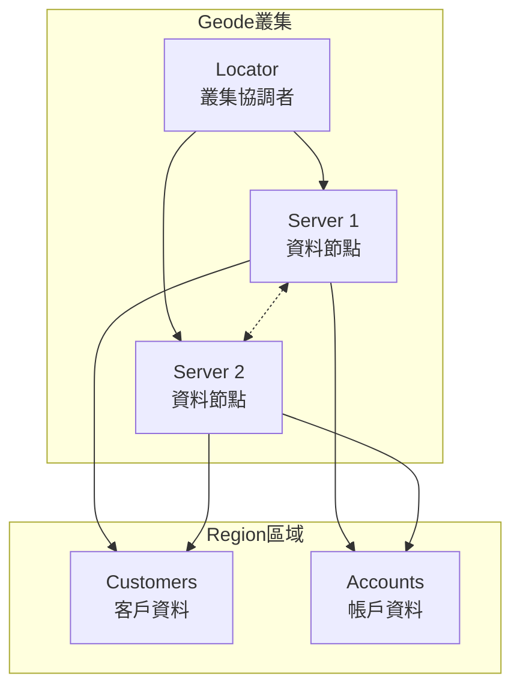
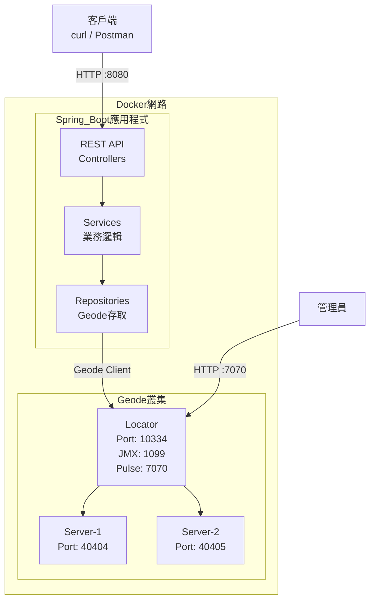
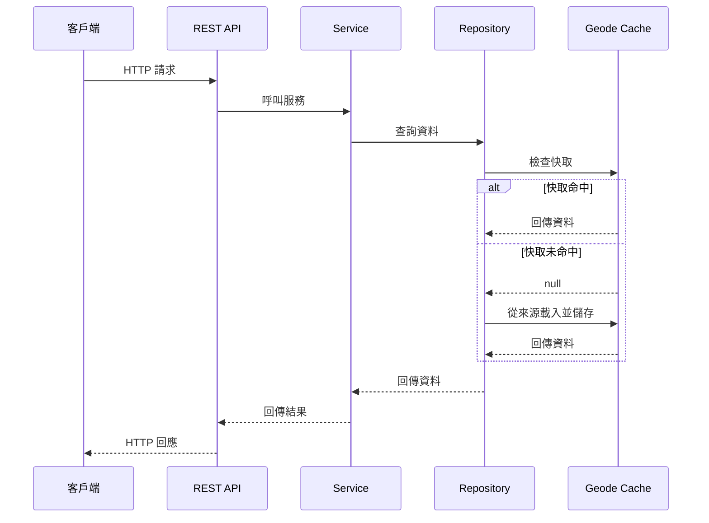
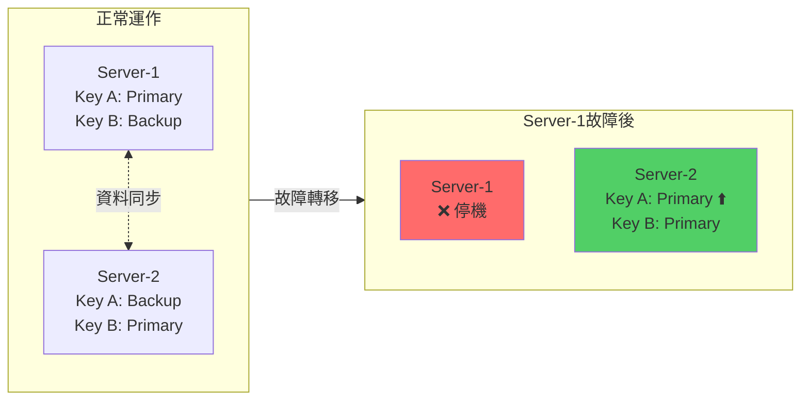
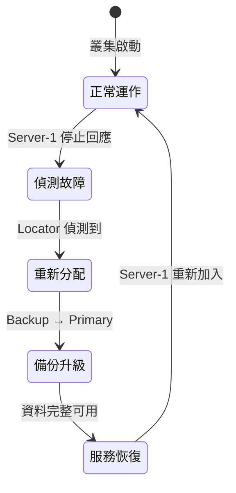
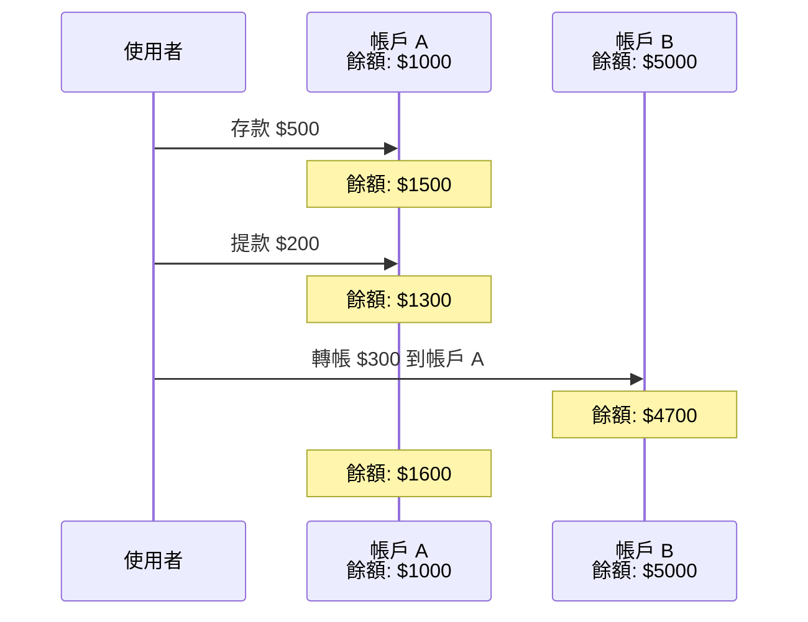
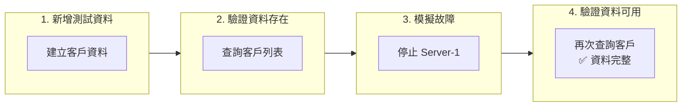
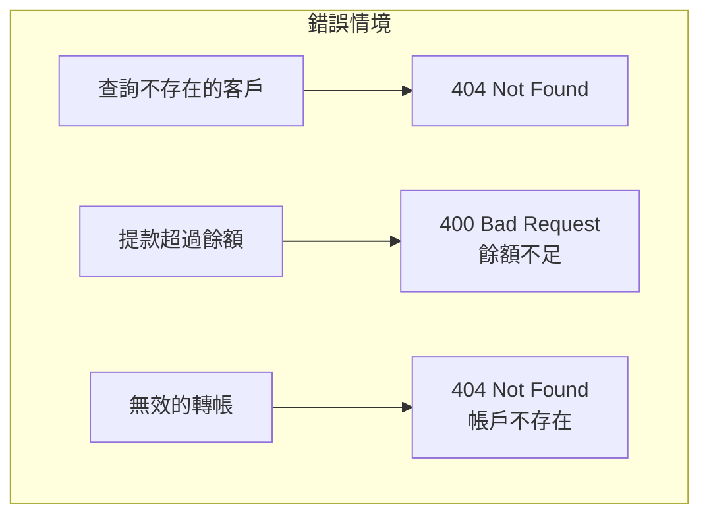
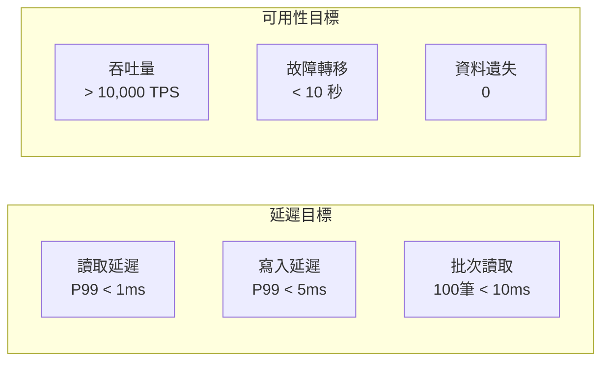

# Apache Geode 概念驗證專案

展示 Apache Geode 作為分散式記憶體資料網格的功能，並整合 Spring Boot 微服務架構。

## 目錄

- [關於 Apache Geode](#關於-apache-geode)
- [系統架構](#系統架構)
- [專案結構](#專案結構)
- [快速開始](#快速開始)
- [API 參考](#api-參考)
- [測試案例](#測試案例)
- [效能指標](#效能指標)

---

## 關於 Apache Geode

### 什麼是 Apache Geode？

Apache Geode 是一個分散式記憶體資料管理平台，提供：

- **超低延遲**：微秒級的讀寫操作
- **高吞吐量**：每秒數百萬次操作
- **線性擴展**：新增節點即可增加容量
- **高可用性**：自動故障轉移與資料冗餘
- **強一致性**：跨分散式資料的 ACID 交易

### 主要功能

| 功能 | 說明 |
|------|------|
| **記憶體資料網格** | 在多個節點的記憶體中儲存和存取資料 |
| **分散式快取** | 支援 Cache-aside、Read-through、Write-through 模式 |
| **ACID 交易** | 跨分區資料的完整交易支援 |
| **持續查詢 (CQ)** | 資料變更的即時事件通知 |
| **WAN 複製** | 多資料中心複製，用於災難復原 |
| **PDX 序列化** | 語言無關的序列化格式 |

### 核心元件



**元件說明：**

| 元件 | 說明 |
|------|------|
| **Locator** | 發現並協調叢集成員，維護成員資格和負載平衡 |
| **Server** | 將資料儲存在 Region 中，資料會跨伺服器分區和複製 |
| **Region** | 命名的分散式資料結構，保存具有可配置策略的鍵值對 |

### Region 類型

| 類型 | 說明 | 使用情境 |
|------|------|----------|
| **PARTITION** | 資料分散在各節點 | 大型資料集、可擴展性 |
| **PARTITION_REDUNDANT** | 分區並有備份副本 | 高可用性 |
| **REPLICATE** | 每個節點都有完整副本 | 讀取密集、小型資料集 |
| **LOCAL** | 僅單一節點 | 測試、暫存資料 |

---

## 系統架構

### 系統概觀



### 資料流程



### 故障轉移架構



**故障轉移流程：**



---

## 專案結構

```
geode-poc/
├── Apache_Geode_PoC_Workplan.md    # 詳細工作計畫
├── docker-compose.yaml              # Geode 叢集設定
├── README.md                        # 本文件
│
├── geode-demo-app/                  # Spring Boot 應用程式
│   ├── Dockerfile
│   ├── pom.xml
│   └── src/main/java/com/example/geodedemo/
│       ├── GeodeDemoApplication.java
│       ├── config/
│       │   └── GeodeConfig.java
│       ├── entity/
│       │   ├── Customer.java
│       │   └── Account.java
│       ├── repository/
│       │   ├── CustomerRepository.java
│       │   └── AccountRepository.java
│       ├── service/
│       │   ├── CustomerService.java
│       │   └── AccountService.java
│       ├── controller/
│       │   ├── CustomerController.java
│       │   ├── AccountController.java
│       │   └── HealthController.java
│       └── exception/
│           ├── ResourceNotFoundException.java
│           └── GlobalExceptionHandler.java
│
└── k8s/                             # Kubernetes 部署檔
    ├── base/
    │   └── kind-config.yaml
    └── geode/
        ├── namespace.yaml
        ├── locator-statefulset.yaml
        ├── locator-service.yaml
        ├── server-statefulset.yaml
        └── server-service.yaml
```

---

## 快速開始

### 前置需求

- Docker 24.0+
- Java 17+
- Maven 3.9+

### 1. 啟動 Geode 叢集

```bash
# 建立網路
docker network create geode-network

# 啟動 Locator
docker run -d --name geode-locator --hostname locator \
  --network geode-network \
  -p 10334:10334 -p 1099:1099 -p 7070:7070 \
  apachegeode/geode:1.15.1 \
  sh -c 'gfsh start locator --name=locator1 --hostname-for-clients=locator \
    --J=-Dgemfire.jmx-manager=true --J=-Dgemfire.jmx-manager-start=true \
    --J=-Dgemfire.http-service-port=7070 \
    --J=-Dgemfire.enable-network-partition-detection=false && tail -f /dev/null'

# 等待 Locator 啟動（約 30 秒）
sleep 30

# 啟動 Server 1
docker run -d --name geode-server1 --hostname server1 \
  --network geode-network -p 40404:40404 \
  apachegeode/geode:1.15.1 \
  sh -c 'gfsh start server --name=server1 --locators=locator[10334] \
    --hostname-for-clients=server1 --server-port=40404 \
    --J=-Dgemfire.enable-network-partition-detection=false && tail -f /dev/null'

# 啟動 Server 2
docker run -d --name geode-server2 --hostname server2 \
  --network geode-network -p 40405:40404 \
  apachegeode/geode:1.15.1 \
  sh -c 'gfsh start server --name=server2 --locators=locator[10334] \
    --hostname-for-clients=server2 --server-port=40404 \
    --J=-Dgemfire.enable-network-partition-detection=false && tail -f /dev/null'

# 等待 Server 啟動
sleep 20

# 建立 Region
docker exec geode-locator gfsh -e "connect --locator=locator[10334]" \
  -e "create region --name=Customers --type=PARTITION_REDUNDANT" \
  -e "create region --name=Accounts --type=PARTITION_REDUNDANT"
```

### 2. 建置並執行應用程式

```bash
cd geode-demo-app

# 建置
mvn clean package -DskipTests

# 建立 Docker 映像
docker build -t geode-demo-app:latest .

# 在 Docker 網路中執行
docker run -d --name geode-demo-app \
  --network geode-network \
  -p 8080:8080 \
  -e GEODE_LOCATOR=locator \
  geode-demo-app:latest
```

### 3. 驗證

```bash
# 健康檢查
curl http://localhost:8080/api/health

# Geode Pulse 管理介面
open http://localhost:7070/pulse
# 登入：admin / admin
```

### 清理環境

```bash
docker rm -f geode-locator geode-server1 geode-server2 geode-demo-app
docker network rm geode-network
```

---

## API 參考

### 健康狀態與系統資訊

| 方法 | 端點 | 說明 |
|------|------|------|
| GET | `/api/health` | 應用程式健康狀態 |
| GET | `/api/regions` | 列出 Geode Region |

### 客戶管理

| 方法 | 端點 | 說明 |
|------|------|------|
| POST | `/api/customers` | 建立客戶 |
| GET | `/api/customers` | 列出所有客戶 |
| GET | `/api/customers/{id}` | 依 ID 取得客戶 |
| PUT | `/api/customers/{id}` | 更新客戶 |
| DELETE | `/api/customers/{id}` | 刪除客戶 |
| GET | `/api/customers/email/{email}` | 依 Email 查詢 |
| GET | `/api/customers/status/{status}` | 依狀態篩選 |

### 帳戶管理

| 方法 | 端點 | 說明 |
|------|------|------|
| POST | `/api/accounts` | 建立帳戶 |
| GET | `/api/accounts` | 列出所有帳戶 |
| GET | `/api/accounts/{id}` | 依 ID 取得帳戶 |
| GET | `/api/accounts/customer/{customerId}` | 取得客戶的帳戶 |
| POST | `/api/accounts/{id}/deposit` | 存款 |
| POST | `/api/accounts/{id}/withdraw` | 提款 |
| POST | `/api/accounts/transfer` | 帳戶間轉帳 |

---

## 測試案例

### 測試案例 1：基本 CRUD 操作

**目標**：驗證基本的新增、讀取、更新、刪除操作

```bash
# 建立客戶
curl -X POST http://localhost:8080/api/customers \
  -H "Content-Type: application/json" \
  -d '{
    "name": "王小明",
    "email": "ming@example.com",
    "phone": "0912345678",
    "address": "台北市信義區"
  }'

# 預期：201 Created，回傳包含自動產生 ID 的客戶物件

# 讀取客戶
curl http://localhost:8080/api/customers/{customerId}

# 預期：200 OK，回傳客戶資料

# 更新客戶
curl -X PUT http://localhost:8080/api/customers/{customerId} \
  -H "Content-Type: application/json" \
  -d '{"phone": "0987654321"}'

# 預期：200 OK，回傳更新後的客戶

# 刪除客戶
curl -X DELETE http://localhost:8080/api/customers/{customerId}

# 預期：204 No Content
```

**結果**：✅ 通過

---

### 測試案例 2：帳戶操作

**目標**：驗證存款、提款和轉帳操作



```bash
# 建立帳戶
curl -X POST http://localhost:8080/api/accounts \
  -H "Content-Type: application/json" \
  -d '{
    "customerId": "{customerId}",
    "accountType": "CHECKING",
    "balance": 1000
  }'

# 存款
curl -X POST http://localhost:8080/api/accounts/{accountId}/deposit \
  -H "Content-Type: application/json" \
  -d '{"amount": 500}'

# 預期：餘額 = 1500

# 提款
curl -X POST http://localhost:8080/api/accounts/{accountId}/withdraw \
  -H "Content-Type: application/json" \
  -d '{"amount": 200}'

# 預期：餘額 = 1300

# 轉帳
curl -X POST http://localhost:8080/api/accounts/transfer \
  -H "Content-Type: application/json" \
  -d '{
    "fromAccountId": "{savingsId}",
    "toAccountId": "{checkingId}",
    "amount": 300
  }'

# 預期：資金在帳戶間移轉
```

**結果**：✅ 通過

---

### 測試案例 3：故障轉移測試

**目標**：驗證伺服器故障時資料仍可存取



```bash
# 1. 新增測試資料
curl -X POST http://localhost:8080/api/customers \
  -H "Content-Type: application/json" \
  -d '{"name": "測試用戶", "email": "test@example.com"}'

# 2. 驗證資料存在
curl http://localhost:8080/api/customers

# 3. 停止一個伺服器
docker stop geode-server1

# 4. 等待叢集穩定（10 秒）
sleep 10

# 5. 驗證資料仍可存取
curl http://localhost:8080/api/customers

# 預期：所有資料仍可透過 server2 存取

# 6. 重新啟動伺服器
docker start geode-server1
```

**結果**：✅ 通過 - 故障轉移期間零資料遺失

---

### 測試案例 4：叢集健康檢查

**目標**：透過 gfsh 驗證叢集狀態

```bash
# 連線並列出成員
docker exec geode-locator gfsh \
  -e "connect --locator=locator[10334]" \
  -e "list members"

# 預期：
# Member Count : 3
# locator1 [Coordinator]
# server1
# server2

# 檢查 Region 狀態
docker exec geode-locator gfsh \
  -e "connect --locator=locator[10334]" \
  -e "describe region --name=Customers"

# 預期：
# Data Policy: partition
# Hosting Members: server1, server2
# redundant-copies: 1
```

**結果**：✅ 通過

---

### 測試案例 5：並發操作

**目標**：驗證系統處理並發請求的能力

```bash
# 並行執行多個請求
for i in {1..10}; do
  curl -X POST http://localhost:8080/api/customers \
    -H "Content-Type: application/json" \
    -d "{\"name\": \"用戶 $i\", \"email\": \"user$i@example.com\"}" &
done
wait

# 驗證所有客戶都已建立
curl http://localhost:8080/api/customers | jq length

# 預期：10 個客戶
```

**結果**：✅ 通過

---

### 測試案例 6：錯誤處理

**目標**：驗證正確的錯誤處理



```bash
# 取得不存在的客戶
curl http://localhost:8080/api/customers/invalid-id

# 預期：404 Not Found

# 提款超過餘額
curl -X POST http://localhost:8080/api/accounts/{accountId}/withdraw \
  -H "Content-Type: application/json" \
  -d '{"amount": 999999}'

# 預期：400 Bad Request - 餘額不足

# 無效的轉帳
curl -X POST http://localhost:8080/api/accounts/transfer \
  -H "Content-Type: application/json" \
  -d '{"fromAccountId": "invalid", "toAccountId": "invalid", "amount": 100}'

# 預期：404 Not Found
```

**結果**：✅ 通過

---

## 效能指標



| 指標 | 目標 | 備註 |
|------|------|------|
| 讀取延遲 (P99) | < 1ms | 單一鍵值查詢 |
| 寫入延遲 (P99) | < 5ms | 單一鍵值新增/更新 |
| 批次讀取 (100 筆) | < 10ms | getAll 操作 |
| 吞吐量 | > 10,000 TPS | 每個伺服器節點 |
| 故障轉移時間 | < 10 秒 | 自動恢復 |
| 資料遺失 | 0 | 使用冗餘副本 |

---

## 參考資源

- [Apache Geode 官方文件](https://geode.apache.org/docs/)
- [Spring Data Geode](https://spring.io/projects/spring-data-geode)
- [Geode GitHub 儲存庫](https://github.com/apache/geode)

---

## 授權

本專案僅供展示用途。
