# Apache Geode 概念驗證專案

展示 Apache Geode 作為分散式記憶體資料網格的功能，並整合 Spring Boot 微服務架構。

## 目錄

- [專案狀態](#專案狀態)
- [功能涵蓋範圍](#功能涵蓋範圍)
- [關於 Apache Geode](#關於-apache-geode)
- [系統架構](#系統架構)
- [專案結構](#專案結構)
- [快速開始](#快速開始)
- [API 參考](#api-參考)
- [測試案例](#測試案例)
- [進階功能](#進階功能)
- [效能指標](#效能指標)

---

## 專案狀態

```mermaid
pie title 功能實作進度
    "已完成" : 8
    "進行中" : 0
    "未開始" : 0
```



| 狀態 | 說明 |
|------|------|
| ✅ 已完成 | 功能已實作並測試通過 |
| 🔄 進行中 | 功能開發中 |
| ⏳ 待開發 | 尚未開始 |

### 實作狀態總覽

| 功能 | 狀態 | 說明 |
|------|------|------|
| 基本 CRUD 操作 | ✅ 已完成 | Customer 和 Account 的新增、讀取、更新、刪除 |
| 帳戶操作 | ✅ 已完成 | 存款、提款、轉帳功能 |
| 故障轉移 | ✅ 已完成 | PARTITION_REDUNDANT Region 確保零資料遺失 |
| ACID 交易 | ✅ 已完成 | 使用 CacheTransactionManager 實現分散式交易 |
| 持續查詢 (CQ) | ✅ 已完成 | 即時監控帳戶餘額變更並產生警示 |
| 磁碟持久化 | ✅ 已完成 | PARTITION_REDUNDANT_PERSISTENT Region |
| Prometheus 監控 | ✅ 已完成 | 整合 Micrometer + Prometheus + Grafana |
| WAN 複製 | ✅ 已完成 | 雙站點 (台灣/日本) 雙向資料複製 |

---

## 功能涵蓋範圍

本 PoC 涵蓋 Apache Geode 的主要企業級功能：

```mermaid
mindmap
  root((Apache Geode PoC))
    資料管理
      CRUD 操作
      Region 類型
        PARTITION
        PARTITION_REDUNDANT
        PARTITION_REDUNDANT_PERSISTENT
      PDX 序列化
    高可用性
      故障轉移
      資料冗餘
      自動恢復
    交易處理
      ACID 交易
      分散式鎖
      衝突偵測
    事件驅動
      持續查詢 CQ
      事件監聽器
      即時警示
    持久化
      磁碟儲存
      寫入日誌
      資料恢復
    多站點
      WAN 複製
      Gateway Sender
      Gateway Receiver
    可觀測性
      Prometheus 指標
      Grafana 儀表板
      JVM 監控
```



### 與 Apache Geode 官方功能對照

| Apache Geode 功能 | 本 PoC 實作 | 說明 |
|------------------|-------------|------|
| **In-Memory Data Grid** | ✅ | 使用 PARTITION_REDUNDANT Region |
| **Distributed Caching** | ✅ | Spring Data Geode Repository |
| **ACID Transactions** | ✅ | CacheTransactionManager |
| **Continuous Query (CQ)** | ✅ | AccountBalanceCqListener |
| **WAN Replication** | ✅ | 雙向 Gateway Sender/Receiver |
| **Persistence** | ✅ | disk-store 配置 |
| **PDX Serialization** | ✅ | @PdxSerializer 註解 |
| **OQL Query** | ✅ | Spring Data Repository 查詢 |
| **Function Execution** | ⏳ | 未實作 (可擴展) |
| **Security** | ⏳ | 未實作 (可擴展) |
| **Lucene Integration** | ⏳ | 未實作 (可擴展) |

---

## 關於 Apache Geode

### 什麼是 Apache Geode？

Apache Geode 是一個分散式記憶體資料管理平台，提供：

- **超低延遲**：微秒級的讀寫操作
- **高吞吐量**：每秒數百萬次操作
- **線性擴展**：新增節點即可增加容量
- **高可用性**：自動故障轉移與資料冗餘
- **強一致性**：跨分散式資料的 ACID 交易

### 主要功能

| 功能 | 說明 |
|------|------|
| **記憶體資料網格** | 在多個節點的記憶體中儲存和存取資料 |
| **分散式快取** | 支援 Cache-aside、Read-through、Write-through 模式 |
| **ACID 交易** | 跨分區資料的完整交易支援 |
| **持續查詢 (CQ)** | 資料變更的即時事件通知 |
| **WAN 複製** | 多資料中心複製，用於災難復原 |
| **PDX 序列化** | 語言無關的序列化格式 |

### 核心元件

```mermaid
graph TB
    subgraph Geode叢集
        L[Locator<br/>叢集協調者]
        S1[Server 1<br/>資料節點]
        S2[Server 2<br/>資料節點]

        L --> S1
        L --> S2
        S1 <-.-> S2
    end

    subgraph Region區域
        R1[Customers<br/>客戶資料]
        R2[Accounts<br/>帳戶資料]
    end

    S1 --> R1
    S1 --> R2
    S2 --> R1
    S2 --> R2
```

**元件說明：**

| 元件 | 說明 |
|------|------|
| **Locator** | 發現並協調叢集成員，維護成員資格和負載平衡 |
| **Server** | 將資料儲存在 Region 中，資料會跨伺服器分區和複製 |
| **Region** | 命名的分散式資料結構，保存具有可配置策略的鍵值對 |

### Region 類型

| 類型 | 說明 | 使用情境 |
|------|------|----------|
| **PARTITION** | 資料分散在各節點 | 大型資料集、可擴展性 |
| **PARTITION_REDUNDANT** | 分區並有備份副本 | 高可用性 |
| **REPLICATE** | 每個節點都有完整副本 | 讀取密集、小型資料集 |
| **LOCAL** | 僅單一節點 | 測試、暫存資料 |

---

## 系統架構

### 系統概觀

```mermaid
graph TB
    subgraph Docker網路
        subgraph Geode叢集
            LOC[Locator<br/>Port: 10334<br/>JMX: 1099<br/>Pulse: 7070]
            SRV1[Server-1<br/>Port: 40404]
            SRV2[Server-2<br/>Port: 40405]

            LOC --> SRV1
            LOC --> SRV2
        end

        subgraph Spring_Boot應用程式
            API[REST API<br/>Controllers]
            SVC[Services<br/>業務邏輯]
            REPO[Repositories<br/>Geode存取]

            API --> SVC
            SVC --> REPO
        end

        REPO -->|Geode Client| LOC
    end

    CLIENT[客戶端<br/>curl / Postman] -->|HTTP :8080| API
    ADMIN[管理員] -->|HTTP :7070| LOC
```

### 資料流程

```mermaid
sequenceDiagram
    participant C as 客戶端
    participant API as REST API
    participant SVC as Service
    participant REPO as Repository
    participant G as Geode Cache

    C->>API: HTTP 請求
    API->>SVC: 呼叫服務
    SVC->>REPO: 查詢資料
    REPO->>G: 檢查快取

    alt 快取命中
        G-->>REPO: 回傳資料
    else 快取未命中
        G-->>REPO: null
        REPO->>G: 從來源載入並儲存
        G-->>REPO: 回傳資料
    end

    REPO-->>SVC: 回傳資料
    SVC-->>API: 回傳結果
    API-->>C: HTTP 回應
```



### 故障轉移架構

```mermaid
graph LR
    subgraph 正常運作
        direction TB
        S1A[Server-1<br/>Key A: Primary<br/>Key B: Backup]
        S2A[Server-2<br/>Key A: Backup<br/>Key B: Primary]
        S1A <-.->|資料同步| S2A
    end

    subgraph Server-1故障後
        direction TB
        S1B[Server-1<br/>❌ 停機]
        S2B[Server-2<br/>Key A: Primary ⬆️<br/>Key B: Primary]

        style S1B fill:#ff6b6b
        style S2B fill:#51cf66
    end

    正常運作 -->|故障轉移| Server-1故障後
```

**故障轉移流程：**

```mermaid
stateDiagram-v2
    [*] --> 正常運作: 叢集啟動
    正常運作 --> 偵測故障: Server-1 停止回應
    偵測故障 --> 重新分配: Locator 偵測到
    重新分配 --> 備份升級: Backup → Primary
    備份升級 --> 服務恢復: 資料完整可用
    服務恢復 --> 正常運作: Server-1 重新加入
```



---

## 專案結構

```
geode-poc/
├── README.md                           # 本文件
├── Apache_Geode_PoC_Workplan.md        # 詳細工作計畫
│
├── docker-compose.yaml                 # 基本 Geode 叢集
├── docker-compose-persistent.yaml      # 帶持久化的叢集
├── docker-compose-full.yaml            # 完整監控堆疊
├── docker-compose-wan.yaml             # WAN 複製雙叢集
│
├── monitoring/                         # 監控配置
│   ├── prometheus.yml                  # Prometheus 抓取配置
│   └── grafana-dashboard.json          # Grafana 儀表板
│
├── scripts/                            # 測試腳本
│   └── test-wan-replication.sh         # WAN 複製測試
│
├── geode-demo-app/                     # Spring Boot 應用程式
│   ├── Dockerfile
│   ├── pom.xml
│   └── src/main/java/com/example/geodedemo/
│       ├── GeodeDemoApplication.java
│       │
│       ├── config/
│       │   └── GeodeConfig.java        # Geode 客戶端配置
│       │
│       ├── entity/                     # 資料實體
│       │   ├── Customer.java
│       │   └── Account.java
│       │
│       ├── repository/                 # 資料存取層
│       │   ├── CustomerRepository.java
│       │   └── AccountRepository.java
│       │
│       ├── service/                    # 業務邏輯層
│       │   ├── CustomerService.java
│       │   ├── AccountService.java
│       │   └── TransactionService.java # ACID 交易服務
│       │
│       ├── controller/                 # REST API 控制器
│       │   ├── CustomerController.java
│       │   ├── AccountController.java
│       │   ├── HealthController.java
│       │   ├── TransactionController.java
│       │   ├── ContinuousQueryController.java
│       │   └── WanController.java
│       │
│       ├── cq/                         # 持續查詢模組
│       │   ├── AccountBalanceCqListener.java
│       │   ├── BalanceChangeEvent.java
│       │   ├── ContinuousQueryService.java
│       │   └── EventStore.java
│       │
│       ├── wan/                        # WAN 複製模組
│       │   ├── WanReplicationInfo.java
│       │   └── WanReplicationService.java
│       │
│       ├── metrics/                    # 監控指標
│       │   └── GeodeMetricsService.java
│       │
│       └── exception/                  # 例外處理
│           ├── ResourceNotFoundException.java
│           └── GlobalExceptionHandler.java
│
└── k8s/                                # Kubernetes 部署檔 (可選)
    ├── base/
    │   └── kind-config.yaml
    └── geode/
        ├── namespace.yaml
        ├── locator-statefulset.yaml
        ├── locator-service.yaml
        ├── server-statefulset.yaml
        └── server-service.yaml
```

---

## 快速開始

### 前置需求

- Docker 24.0+
- Java 17+
- Maven 3.9+

### 1. 啟動 Geode 叢集

```bash
# 建立網路
docker network create geode-network

# 啟動 Locator
docker run -d --name geode-locator --hostname locator \
  --network geode-network \
  -p 10334:10334 -p 1099:1099 -p 7070:7070 \
  apachegeode/geode:1.15.1 \
  sh -c 'gfsh start locator --name=locator1 --hostname-for-clients=locator \
    --J=-Dgemfire.jmx-manager=true --J=-Dgemfire.jmx-manager-start=true \
    --J=-Dgemfire.http-service-port=7070 \
    --J=-Dgemfire.enable-network-partition-detection=false && tail -f /dev/null'

# 等待 Locator 啟動（約 30 秒）
sleep 30

# 啟動 Server 1
docker run -d --name geode-server1 --hostname server1 \
  --network geode-network -p 40404:40404 \
  apachegeode/geode:1.15.1 \
  sh -c 'gfsh start server --name=server1 --locators=locator[10334] \
    --hostname-for-clients=server1 --server-port=40404 \
    --J=-Dgemfire.enable-network-partition-detection=false && tail -f /dev/null'

# 啟動 Server 2
docker run -d --name geode-server2 --hostname server2 \
  --network geode-network -p 40405:40404 \
  apachegeode/geode:1.15.1 \
  sh -c 'gfsh start server --name=server2 --locators=locator[10334] \
    --hostname-for-clients=server2 --server-port=40404 \
    --J=-Dgemfire.enable-network-partition-detection=false && tail -f /dev/null'

# 等待 Server 啟動
sleep 20

# 建立 Region
docker exec geode-locator gfsh -e "connect --locator=locator[10334]" \
  -e "create region --name=Customers --type=PARTITION_REDUNDANT" \
  -e "create region --name=Accounts --type=PARTITION_REDUNDANT"
```

### 2. 建置並執行應用程式

```bash
cd geode-demo-app

# 建置
mvn clean package -DskipTests

# 建立 Docker 映像
docker build -t geode-demo-app:latest .

# 在 Docker 網路中執行
docker run -d --name geode-demo-app \
  --network geode-network \
  -p 8080:8080 \
  -e GEODE_LOCATOR=locator \
  geode-demo-app:latest
```

### 3. 驗證

```bash
# 健康檢查
curl http://localhost:8080/api/health

# Geode Pulse 管理介面
open http://localhost:7070/pulse
# 登入：admin / admin
```

### 清理環境

```bash
docker rm -f geode-locator geode-server1 geode-server2 geode-demo-app
docker network rm geode-network
```

---

## API 參考

### 健康狀態與系統資訊

| 方法 | 端點 | 說明 |
|------|------|------|
| GET | `/api/health` | 應用程式健康狀態 |
| GET | `/api/regions` | 列出 Geode Region |

### 客戶管理

| 方法 | 端點 | 說明 |
|------|------|------|
| POST | `/api/customers` | 建立客戶 |
| GET | `/api/customers` | 列出所有客戶 |
| GET | `/api/customers/{id}` | 依 ID 取得客戶 |
| PUT | `/api/customers/{id}` | 更新客戶 |
| DELETE | `/api/customers/{id}` | 刪除客戶 |
| GET | `/api/customers/email/{email}` | 依 Email 查詢 |
| GET | `/api/customers/status/{status}` | 依狀態篩選 |

### 帳戶管理

| 方法 | 端點 | 說明 |
|------|------|------|
| POST | `/api/accounts` | 建立帳戶 |
| GET | `/api/accounts` | 列出所有帳戶 |
| GET | `/api/accounts/{id}` | 依 ID 取得帳戶 |
| GET | `/api/accounts/customer/{customerId}` | 取得客戶的帳戶 |
| POST | `/api/accounts/{id}/deposit` | 存款 |
| POST | `/api/accounts/{id}/withdraw` | 提款 |
| POST | `/api/accounts/transfer` | 帳戶間轉帳 |

---

## 測試案例

### 測試案例 1：基本 CRUD 操作

**目標**：驗證基本的新增、讀取、更新、刪除操作

```bash
# 建立客戶
curl -X POST http://localhost:8080/api/customers \
  -H "Content-Type: application/json" \
  -d '{
    "name": "王小明",
    "email": "ming@example.com",
    "phone": "0912345678",
    "address": "台北市信義區"
  }'

# 預期：201 Created，回傳包含自動產生 ID 的客戶物件

# 讀取客戶
curl http://localhost:8080/api/customers/{customerId}

# 預期：200 OK，回傳客戶資料

# 更新客戶
curl -X PUT http://localhost:8080/api/customers/{customerId} \
  -H "Content-Type: application/json" \
  -d '{"phone": "0987654321"}'

# 預期：200 OK，回傳更新後的客戶

# 刪除客戶
curl -X DELETE http://localhost:8080/api/customers/{customerId}

# 預期：204 No Content
```

**結果**：✅ 通過

---

### 測試案例 2：帳戶操作

**目標**：驗證存款、提款和轉帳操作

```mermaid
sequenceDiagram
    participant U as 使用者
    participant A as 帳戶 A<br/>餘額: $1000
    participant B as 帳戶 B<br/>餘額: $5000

    U->>A: 存款 $500
    Note over A: 餘額: $1500

    U->>A: 提款 $200
    Note over A: 餘額: $1300

    U->>B: 轉帳 $300 到帳戶 A
    Note over B: 餘額: $4700
    Note over A: 餘額: $1600
```



```bash
# 建立帳戶
curl -X POST http://localhost:8080/api/accounts \
  -H "Content-Type: application/json" \
  -d '{
    "customerId": "{customerId}",
    "accountType": "CHECKING",
    "balance": 1000
  }'

# 存款
curl -X POST http://localhost:8080/api/accounts/{accountId}/deposit \
  -H "Content-Type: application/json" \
  -d '{"amount": 500}'

# 預期：餘額 = 1500

# 提款
curl -X POST http://localhost:8080/api/accounts/{accountId}/withdraw \
  -H "Content-Type: application/json" \
  -d '{"amount": 200}'

# 預期：餘額 = 1300

# 轉帳
curl -X POST http://localhost:8080/api/accounts/transfer \
  -H "Content-Type: application/json" \
  -d '{
    "fromAccountId": "{savingsId}",
    "toAccountId": "{checkingId}",
    "amount": 300
  }'

# 預期：資金在帳戶間移轉
```

**結果**：✅ 通過

---

### 測試案例 3：故障轉移測試

**目標**：驗證伺服器故障時資料仍可存取

```mermaid
graph LR
    subgraph 步驟1[1. 新增測試資料]
        D1[建立客戶資料]
    end

    subgraph 步驟2[2. 驗證資料存在]
        D2[查詢客戶列表]
    end

    subgraph 步驟3[3. 模擬故障]
        D3[停止 Server-1]
    end

    subgraph 步驟4[4. 驗證資料可用]
        D4[再次查詢客戶<br/>✅ 資料完整]
    end

    步驟1 --> 步驟2 --> 步驟3 --> 步驟4
```

```bash
# 1. 新增測試資料
curl -X POST http://localhost:8080/api/customers \
  -H "Content-Type: application/json" \
  -d '{"name": "測試用戶", "email": "test@example.com"}'

# 2. 驗證資料存在
curl http://localhost:8080/api/customers

# 3. 停止一個伺服器
docker stop geode-server1

# 4. 等待叢集穩定（10 秒）
sleep 10

# 5. 驗證資料仍可存取
curl http://localhost:8080/api/customers

# 預期：所有資料仍可透過 server2 存取

# 6. 重新啟動伺服器
docker start geode-server1
```

**結果**：✅ 通過 - 故障轉移期間零資料遺失

---

### 測試案例 4：叢集健康檢查

**目標**：透過 gfsh 驗證叢集狀態

```bash
# 連線並列出成員
docker exec geode-locator gfsh \
  -e "connect --locator=locator[10334]" \
  -e "list members"

# 預期：
# Member Count : 3
# locator1 [Coordinator]
# server1
# server2

# 檢查 Region 狀態
docker exec geode-locator gfsh \
  -e "connect --locator=locator[10334]" \
  -e "describe region --name=Customers"

# 預期：
# Data Policy: partition
# Hosting Members: server1, server2
# redundant-copies: 1
```

**結果**：✅ 通過

---

### 測試案例 5：並發操作

**目標**：驗證系統處理並發請求的能力

```bash
# 並行執行多個請求
for i in {1..10}; do
  curl -X POST http://localhost:8080/api/customers \
    -H "Content-Type: application/json" \
    -d "{\"name\": \"用戶 $i\", \"email\": \"user$i@example.com\"}" &
done
wait

# 驗證所有客戶都已建立
curl http://localhost:8080/api/customers | jq length

# 預期：10 個客戶
```

**結果**：✅ 通過

---

### 測試案例 6：錯誤處理

**目標**：驗證正確的錯誤處理

```mermaid
graph TD
    subgraph 錯誤情境
        E1[查詢不存在的客戶] --> R1[404 Not Found]
        E2[提款超過餘額] --> R2[400 Bad Request<br/>餘額不足]
        E3[無效的轉帳] --> R3[404 Not Found<br/>帳戶不存在]
    end
```

```bash
# 取得不存在的客戶
curl http://localhost:8080/api/customers/invalid-id

# 預期：404 Not Found

# 提款超過餘額
curl -X POST http://localhost:8080/api/accounts/{accountId}/withdraw \
  -H "Content-Type: application/json" \
  -d '{"amount": 999999}'

# 預期：400 Bad Request - 餘額不足

# 無效的轉帳
curl -X POST http://localhost:8080/api/accounts/transfer \
  -H "Content-Type: application/json" \
  -d '{"fromAccountId": "invalid", "toAccountId": "invalid", "amount": 100}'

# 預期：404 Not Found
```

**結果**：✅ 通過

---

## 效能指標

```mermaid
graph LR
    subgraph 延遲目標
        R[讀取延遲<br/>P99 < 1ms]
        W[寫入延遲<br/>P99 < 5ms]
        B[批次讀取<br/>100筆 < 10ms]
    end

    subgraph 可用性目標
        T[吞吐量<br/>> 10,000 TPS]
        F[故障轉移<br/>< 10 秒]
        D[資料遺失<br/>0]
    end
```

| 指標 | 目標 | 備註 |
|------|------|------|
| 讀取延遲 (P99) | < 1ms | 單一鍵值查詢 |
| 寫入延遲 (P99) | < 5ms | 單一鍵值新增/更新 |
| 批次讀取 (100 筆) | < 10ms | getAll 操作 |
| 吞吐量 | > 10,000 TPS | 每個伺服器節點 |
| 故障轉移時間 | < 10 秒 | 自動恢復 |
| 資料遺失 | 0 | 使用冗餘副本 |

---

## 進階功能

### ACID 交易

支援跨 Region 的分散式 ACID 交易。

```mermaid
sequenceDiagram
    participant C as 客戶端
    participant TM as TransactionManager
    participant A as 帳戶 A
    participant B as 帳戶 B

    C->>TM: 開始交易
    TM->>A: 扣款 $500
    TM->>B: 存款 $500

    alt 成功
        TM->>TM: commit()
        TM-->>C: 交易成功
    else 失敗
        TM->>TM: rollback()
        Note over A,B: 兩者皆還原
        TM-->>C: 交易回滾
    end
```



```bash
# 使用交易進行轉帳
curl -X POST http://localhost:8080/api/transactions/transfer \
  -H "Content-Type: application/json" \
  -d '{
    "fromAccountId": "ACC-001",
    "toAccountId": "ACC-002",
    "amount": 500
  }'

# 查詢交易歷史
curl http://localhost:8080/api/transactions/history?limit=10
```

---

### 持續查詢 (Continuous Query)

即時監控資料變更，當帳戶餘額發生變化時自動觸發事件。

```mermaid
graph TB
    subgraph Geode叢集
        R[Accounts Region]
        CQ[CQ 監聽器<br/>SELECT * FROM /Accounts]
    end

    subgraph 事件處理
        E1[餘額低於閾值 → 警示]
        E2[大額交易 → 通知]
        E3[帳戶變更 → 記錄]
    end

    R -->|資料變更| CQ
    CQ --> E1
    CQ --> E2
    CQ --> E3
```

```bash
# 啟動 CQ 監控
curl -X POST http://localhost:8080/api/cq/start

# 查看 CQ 事件
curl http://localhost:8080/api/cq/events

# 查看警示
curl http://localhost:8080/api/cq/events/alerts

# 停止 CQ 監控
curl -X POST http://localhost:8080/api/cq/stop
```

---

### 磁碟持久化

資料持久化到磁碟，確保重啟後資料不遺失。

```bash
# 啟動帶持久化的叢集
docker-compose -f docker-compose-persistent.yaml up -d

# Region 類型: PARTITION_REDUNDANT_PERSISTENT
# 資料會同步寫入 disk-store
```

---

### Prometheus 監控

整合 Prometheus + Grafana 監控堆疊，提供完整的可觀測性解決方案。

```mermaid
graph LR
    subgraph 應用程式
        APP[Spring Boot App<br/>:8080/actuator/prometheus]
    end

    subgraph 監控堆疊
        P[Prometheus<br/>:9090]
        G[Grafana<br/>:3000]
    end

    APP -->|抓取指標| P
    P -->|資料來源| G
```

#### 監控存取資訊

| 服務 | URL | 帳號/密碼 | 說明 |
|------|-----|-----------|------|
| **Prometheus** | http://localhost:9090 | - | 指標查詢與警示 |
| **Grafana** | http://localhost:3000 | admin / admin | 視覺化儀表板 |
| **Geode Pulse** | http://localhost:7070/pulse | admin / admin | Geode 原生監控 |
| **應用程式指標** | http://localhost:8080/actuator/prometheus | - | 原始指標端點 |

#### Prometheus 使用說明

Prometheus 提供強大的 PromQL 查詢語言，可即時查詢 Geode 指標：

```promql
# 查看 Region 大小
geode_region_size

# 查看讀取延遲 (過去 5 分鐘平均)
rate(geode_operation_duration_seconds_sum{operation="read"}[5m])
  / rate(geode_operation_duration_seconds_count{operation="read"}[5m])

# 查看每秒操作數
rate(geode_operation_duration_seconds_count[1m])

# 檢查快取連接狀態
geode_cache_connected
```

**Prometheus 介面功能：**

| 頁面 | 路徑 | 說明 |
|------|------|------|
| Graph | `/graph` | 執行 PromQL 查詢並視覺化 |
| Targets | `/targets` | 查看抓取目標狀態 |
| Alerts | `/alerts` | 查看警示規則 |
| Status | `/status` | 系統狀態資訊 |

#### Grafana 使用說明

預配置的 Apache Geode Dashboard 包含：

| 面板 | 指標 | 說明 |
|------|------|------|
| Customers Count | `geode_region_size{region="Customers"}` | 客戶資料筆數 |
| Accounts Count | `geode_region_size{region="Accounts"}` | 帳戶資料筆數 |
| Total Transactions | `geode_transactions_total` | 累計交易次數 |
| Failed Transactions | `geode_transactions_failed` | 失敗交易次數 |
| Operation Latency | `geode_operation_duration_seconds` | 讀寫延遲時序圖 |
| Operations/sec | `rate(geode_operation_duration_seconds_count)` | 每秒操作數 |
| JVM Memory | `jvm_memory_used_bytes` | JVM 記憶體使用 |
| CQ Events | `geode_cq_events_total` | 持續查詢事件數 |

**首次設定 Grafana：**

1. 開啟 http://localhost:3000
2. 使用 admin / admin 登入
3. 新增 Prometheus 資料來源：
   - Configuration → Data Sources → Add data source
   - 選擇 Prometheus
   - URL: `http://prometheus:9090`
   - 點擊 Save & Test
4. 匯入 Dashboard：
   - Dashboards → Import
   - 上傳 `monitoring/grafana-dashboard.json`

#### 可用指標

| 指標 | 類型 | 說明 |
|------|------|------|
| `geode_region_size` | Gauge | Region 中的項目數量 |
| `geode_transactions_total` | Gauge | 交易總數 |
| `geode_transactions_failed` | Gauge | 失敗交易數 |
| `geode_operation_duration_seconds` | Timer | 讀寫操作延遲 (histogram) |
| `geode_transaction_duration_seconds` | Timer | 交易執行時間 |
| `geode_cq_events_total` | Gauge | CQ 事件總數 |
| `geode_cache_connected` | Gauge | 快取連接狀態 (0/1) |

#### JVM 標準指標

透過 Micrometer 自動暴露的 JVM 指標：

| 指標 | 說明 |
|------|------|
| `jvm_memory_used_bytes` | JVM 記憶體使用量 |
| `jvm_memory_max_bytes` | JVM 記憶體上限 |
| `jvm_gc_pause_seconds` | GC 暫停時間 |
| `jvm_threads_live_threads` | 活躍執行緒數 |
| `process_cpu_usage` | CPU 使用率 |

```bash
# 啟動完整監控堆疊
docker-compose -f docker-compose-full.yaml up -d

# 或手動啟動各服務
docker run -d --name prometheus --network geode-network -p 9090:9090 \
  -v $(pwd)/monitoring/prometheus.yml:/etc/prometheus/prometheus.yml:ro \
  prom/prometheus:latest

docker run -d --name grafana --network geode-network -p 3000:3000 \
  -e GF_SECURITY_ADMIN_PASSWORD=admin \
  grafana/grafana:latest
```

---

### WAN 複製

跨資料中心的雙向資料複製，用於災難復原。

```mermaid
graph TB
    subgraph Site_A[站點 A - 台灣]
        LA[Locator A<br/>DS-ID: 1]
        SA[Server A]
        GS_A[Gateway Sender<br/>→ Site B]
        GR_A[Gateway Receiver]

        LA --> SA
        SA --> GS_A
        SA --> GR_A
    end

    subgraph Site_B[站點 B - 日本]
        LB[Locator B<br/>DS-ID: 2]
        SB[Server B]
        GS_B[Gateway Sender<br/>→ Site A]
        GR_B[Gateway Receiver]

        LB --> SB
        SB --> GS_B
        SB --> GR_B
    end

    GS_A -.->|WAN 複製| GR_B
    GS_B -.->|WAN 複製| GR_A

    style Site_A fill:#e3f2fd
    style Site_B fill:#fff3e0
```



**WAN 配置參數：**

| 參數 | Site A | Site B |
|------|--------|--------|
| distributed-system-id | 1 | 2 |
| remote-locators | locator-site-b[10334] | locator-site-a[10334] |
| Gateway Sender ID | sender-to-site-b | sender-to-site-a |

```bash
# 啟動 WAN 複製叢集
docker-compose -f docker-compose-wan.yaml up -d

# 測試 WAN 複製
./scripts/test-wan-replication.sh

# API 查詢 WAN 狀態
curl http://localhost:8080/api/wan/status
curl http://localhost:8080/api/wan/pools
```

---

### 測試案例 7：WAN 複製測試

**目標**：驗證跨站點資料複製

```mermaid
sequenceDiagram
    participant A as 站點 A (台灣)
    participant B as 站點 B (日本)

    A->>A: 寫入客戶 WAN-001
    A->>B: Gateway Sender 複製
    B->>B: 驗證 WAN-001 存在 ✅

    B->>B: 寫入客戶 WAN-002
    B->>A: Gateway Sender 複製
    A->>A: 驗證 WAN-002 存在 ✅
```



```bash
# 在 Site A 寫入資料
docker exec geode-server-site-a gfsh \
  -e "connect --locator=locator-site-a[10334]" \
  -e "put --region=/Customers --key=WAN-001 --value='Taiwan Customer'"

# 在 Site B 驗證複製
docker exec geode-server-site-b gfsh \
  -e "connect --locator=locator-site-b[10334]" \
  -e "get --region=/Customers --key=WAN-001"

# 預期：資料已複製到 Site B
```

**結果**：✅ 通過 - 雙向複製正常運作

---

## Docker Compose 檔案

| 檔案 | 說明 |
|------|------|
| `docker-compose.yaml` | 基本 Geode 叢集 |
| `docker-compose-persistent.yaml` | 帶磁碟持久化的叢集 |
| `docker-compose-full.yaml` | 完整堆疊 (Geode + App + Prometheus + Grafana) |
| `docker-compose-wan.yaml` | WAN 複製雙叢集 |

---

## 參考資源

- [Apache Geode 官方文件](https://geode.apache.org/docs/)
- [Spring Data Geode](https://spring.io/projects/spring-data-geode)
- [Geode GitHub 儲存庫](https://github.com/apache/geode)
- [Geode WAN 複製指南](https://geode.apache.org/docs/guide/115/topologies_and_comm/multi_site_configuration/chapter_overview.html)

---

## 場景說明

### 場景 1：分散式快取與 CRUD 操作

**問題**：傳統資料庫在高併發場景下延遲高、吞吐量受限。

**解決方案**：使用 Apache Geode 作為分散式記憶體快取層。

```mermaid
graph LR
    subgraph 傳統架構
        A1[應用程式] -->|每次查詢| DB1[(資料庫)]
    end

    subgraph Geode 架構
        A2[應用程式] -->|快取命中| G[Geode Cache]
        G -.->|快取未命中| DB2[(資料庫)]
    end

    style G fill:#4CAF50
```

**實作重點**：
- 使用 Spring Data Geode Repository 簡化資料存取
- `@Region` 註解定義資料儲存區域
- PDX 序列化確保跨語言相容性

---

### 場景 2：高可用性與故障轉移

**問題**：單點故障導致服務中斷和資料遺失。

**解決方案**：使用 PARTITION_REDUNDANT Region 確保資料冗餘。

```mermaid
graph TB
    subgraph 正常狀態
        S1[Server 1<br/>Primary: A, C<br/>Backup: B, D]
        S2[Server 2<br/>Primary: B, D<br/>Backup: A, C]
        S1 <-->|同步| S2
    end

    subgraph Server 1 故障
        S1X[Server 1 ❌]
        S2OK[Server 2<br/>Primary: A, B, C, D]
        style S1X fill:#ff6b6b
        style S2OK fill:#4CAF50
    end
```

**測試結果**：
- 停止 Server 1 後，所有資料仍可透過 Server 2 存取
- 故障轉移時間 < 10 秒
- 零資料遺失

---

### 場景 3：ACID 分散式交易

**問題**：跨帳戶轉帳需要原子性操作，避免資金不一致。

**解決方案**：使用 Geode CacheTransactionManager 實現分散式 ACID 交易。

```mermaid
sequenceDiagram
    participant App as 應用程式
    participant TxMgr as 交易管理器
    participant AccA as 帳戶 A
    participant AccB as 帳戶 B

    App->>TxMgr: begin()
    TxMgr->>AccA: 扣款 $1000
    TxMgr->>AccB: 存款 $1000

    alt 所有操作成功
        TxMgr->>TxMgr: commit()
        TxMgr-->>App: 成功
    else 任一操作失敗
        TxMgr->>TxMgr: rollback()
        Note over AccA,AccB: 所有變更還原
        TxMgr-->>App: 失敗
    end
```



**實作重點**：
- `TransactionService.transferWithTransaction()` 實現原子轉帳
- 自動偵測衝突並回滾
- 支援批次更新操作

---

### 場景 4：即時事件通知 (Continuous Query)

**問題**：需要即時監控帳戶餘額變化並發送警示。

**解決方案**：使用 Geode 持續查詢 (CQ) 訂閱資料變更事件。

```mermaid
graph TB
    subgraph Geode 叢集
        R[/Accounts Region/]
        CQ[CQ: SELECT * FROM /Accounts]
    end

    subgraph 事件處理
        L[AccountBalanceCqListener]
        ES[EventStore]
    end

    subgraph 警示類型
        A1[LOW_BALANCE<br/>餘額 < $100]
        A2[LARGE_TRANSACTION<br/>變動 > $1000]
    end

    R -->|資料變更| CQ
    CQ -->|事件| L
    L -->|儲存| ES
    L -->|判斷| A1
    L -->|判斷| A2
```

**警示閾值**：
| 警示類型 | 閾值 | 說明 |
|---------|------|------|
| LOW_BALANCE | < $100 | 餘額過低警告 |
| LARGE_TRANSACTION | > $1000 | 大額交易通知 |

---

### 場景 5：資料持久化

**問題**：記憶體資料在重啟後遺失。

**解決方案**：配置 disk-store 將資料持久化到磁碟。

```mermaid
graph LR
    subgraph 寫入流程
        W[寫入操作] --> M[記憶體]
        M --> D[磁碟]
    end

    subgraph 恢復流程
        D2[磁碟] --> M2[記憶體]
        M2 --> R[服務就緒]
    end

    style M fill:#4CAF50
    style D fill:#2196F3
```

**配置**：
```yaml
# docker-compose-persistent.yaml
--type=PARTITION_REDUNDANT_PERSISTENT
--disk-store=geode-disk-store
```

---

### 場景 6：跨資料中心複製 (WAN Replication)

**問題**：需要在多個地理位置部署，實現災難復原。

**解決方案**：使用 Geode WAN 複製在多個站點間同步資料。

```mermaid
graph TB
    subgraph Taiwan[台灣站點 DS-ID: 1]
        LT[Locator]
        ST[Server]
        GST[Gateway Sender<br/>→ Japan]
        GRT[Gateway Receiver]
    end

    subgraph Japan[日本站點 DS-ID: 2]
        LJ[Locator]
        SJ[Server]
        GSJ[Gateway Sender<br/>→ Taiwan]
        GRJ[Gateway Receiver]
    end

    GST -.->|非同步複製| GRJ
    GSJ -.->|非同步複製| GRT

    style Taiwan fill:#e3f2fd
    style Japan fill:#fff3e0
```

**複製模式**：
- **Active-Active**：兩站點都可讀寫
- **非同步複製**：不影響本地寫入效能
- **衝突解決**：使用時間戳記

---

### 場景 7：可觀測性與監控

**問題**：需要即時監控系統健康狀態和效能指標。

**解決方案**：整合 Prometheus + Grafana 監控堆疊。

```mermaid
graph LR
    subgraph 應用程式
        App[Spring Boot]
        Metrics[Micrometer]
        App --> Metrics
    end

    subgraph 監控堆疊
        P[Prometheus<br/>:9090]
        G[Grafana<br/>:3000]
    end

    Metrics -->|/actuator/prometheus| P
    P --> G

    style P fill:#E6522C
    style G fill:#F46800
```

**監控指標**：

| 指標類別 | 指標名稱 | 說明 |
|---------|---------|------|
| Region | `geode_region_size` | 資料筆數 |
| 交易 | `geode_transactions_total` | 交易總數 |
| 交易 | `geode_transactions_failed` | 失敗交易數 |
| 效能 | `geode_operation_duration_seconds` | 操作延遲 |
| CQ | `geode_cq_events_total` | CQ 事件數 |
| JVM | `jvm_memory_used_bytes` | 記憶體使用 |

---

## 技術堆疊

| 類別 | 技術 | 版本 |
|------|------|------|
| 分散式快取 | Apache Geode | 1.15.1 |
| 應用框架 | Spring Boot | 2.7.18 |
| 資料存取 | Spring Data Geode | 1.7.5 |
| 監控 | Micrometer + Prometheus | latest |
| 視覺化 | Grafana | latest |
| 容器化 | Docker | 24.0+ |
| 建置工具 | Maven | 3.9+ |
| 執行環境 | Java | 17+ |

---

## 授權

本專案僅供展示用途。
